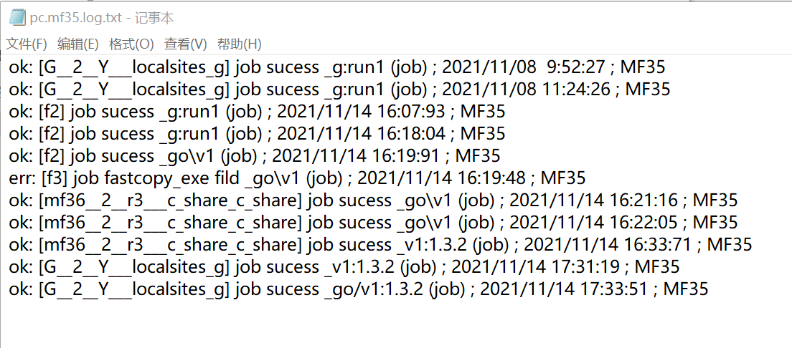

# mfbaktool guide 用法

## 关于 about mfbaktool

1. 基于 [***FastCopy***](http://fastcopy.jp) 写的备份脚本

    方便设置到 `windows计划任务` 里，执行成功或者失败都能写入日志。

2. 目前v1版本`ver1.3.2`仅支持 **fastcopy** 的 `job` 功能

3. 后续版本准备增加多任务功能，以及配合bitlocker 加密备份功能


## 推荐用法 user guide 


1. 点开`v1/`下面的fastcopy.exe，新建任务，任务名 ：`any_your_job_name_1`

   将`v1/`下面的 `demo_job.bat` 复制到你备份的目标文件夹父目录下（即，和目标文件夹同级）

2. 重命名你复制的 `demo_job.bat` 为  `mbt_1---你的fastcopy任务名---需检测的源目录路径.bat`

    例如：
     `mbt_1---any_your_job_name_1---C##test 1#bak source dir#.bat`
    意为： 
    检测 `C:\test 1\bak source dir\` 
    如果存在就执行fastcopy任务 `any_your_job_name_1`

    由于windows不允许 `：\` 作为文件名，所以请将它替换为`#`
    同时不支持你的检测目录名含#号
    你可以修改源文件来支持#号，如果你有特别需要。
    文件名的切分符号为至少三个连续的---，你可以在源文件里修改为别的

3.  如果你的`mbt_1..your name.. .bat`文件和`job_1.bat(/v1/)`文件在同目录，不需要修改

    如果你的`mbt_1..your name.. .bat`文件和`job_1.bat(/v1/)`文件不在同目录，则需要如下修改
    打开你重名命的文件(例如：`mbt_1---any_your_job_name_1---C##test 1#bak source dir#.bat`)，修改其中两处变量：

```bat

set "mbt_tool_dir=D:\some directory\\mfbaktool\v1\"
:: mfbaktool执行脚本的目录
:: File directory where job_1.bat is stored

set "mbt_log_custom=C:\some_path\your bak directory\any bakname.log.txt"
:: 存放你备份日志文件名，必需以.txt结尾
:: The directory where your backup logs are stored

```


4. 执行 `mbt_1..your name.. .bat` (double click) 就能看到效果

    execute `mbt_1..your name.. .bat` and you will see

    


5. 如果你自己有fastcopy.exe安装目录

    编辑 `job_1.bat`

    修改 `"fastcopy_dir=fastcopy392\"`

    例如： `“fastcopy_dir=D:\path of your fastcopy install directory\“`

## welcome issue or pr

    any question,issue please, thanks！

    有任何问题请联系，谢谢！


<!-- 

## git init help

first init

echo "# mfbaktool_dev" >> README.md

git init
git add README.md

git commit -m "first commit"

git branch -M main

git remote add origin https://github.com/codecoke/mfbaktool.git

git push -u origin main


![avatar][base64str]

[base64str]:data:image/png;base64,iVBORw0......

-->